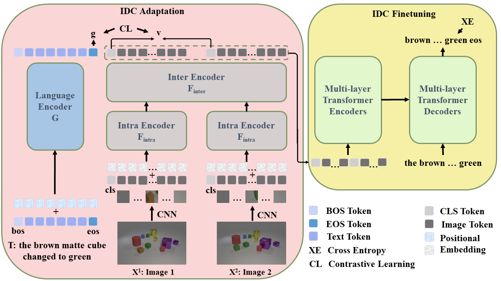

# CLIP4IDC: CLIP for Image Difference Captioning

The implementation of paper [**CLIP4IDC: CLIP for Image Difference Captioning**](https://arxiv.org/abs/2206.00629). 

CLIP4IDC is a image difference captioning model based on [CLIP (ViT-B)](https://github.com/openai/CLIP). The model achieve competitive results on CLEVR-Change, Spot-the-Diff and Image Editing Request.



## Requirement
```sh
# From CLIP
conda install --yes -c pytorch pytorch=1.7.1 torchvision cudatoolkit=11.0
pip install ftfy regex tqdm
pip install opencv-python boto3 requests pandas
pip install "git+https://github.com/salaniz/pycocoevalcap.git"
```

## Data Preparing

**For CLEVR-Change**

The official data can be found here: [google drive link](https://drive.google.com/file/d/1HJ3gWjaUJykEckyb2M0MB4HnrJSihjVe/view) provided by [Robust Change Captioning (ICCV19)](https://github.com/Seth-Park/RobustChangeCaptioning). 

Extracting this file will create data directory.

```sh
tar -xzvf clevr_change.tar.gz
```

**For Spot-the-Diff**

Resized images can be download from [Learning to Describe Differences Between Pairs of Similar Images (EMNLP18)](https://github.com/harsh19/spot-the-diff/blob/master/data/get_images.txt). Raw captions can be download from [link](https://github.com/harsh19/spot-the-diff/tree/master/data/annotations). 

Collecting the captions belonging to the same image pair by running

```sh
python preprocess/reformat_dataset.py
```

For the convenience, you can also download the three json files from [link](https://drive.google.com/drive/folders/1g8QD6Y3La8cIamE7jeSSlXTw8G3r5Q8o?usp=sharing).

You would get

```
your_data_path
|–– clevr_change/
|   |–– data/
|   |   |–– images/
|   |   |–– nsc_images/
|   |   |–– sc_images/
|   |   |–– sc_images/
|   |   |–– change_captions.json
|   |   |–– no_change_captions.json
|   |   |–– splits.json
|   |   |–– type_mapping.json
|–– spot-the-diff/
|   |–– images/
|   |–– data/
|   |–– train.json
|   |–– val.json
|   |–– test.json
|   |–– reformat_train.json
|   |–– reformat_val.json
|   |–– reformat_test.json
```


## Prepare for Evaluation

**For CLEVR-Change**

To evaluate captions, we need to first reformat the caption annotations into COCO eval tool format. Please run the command `python utils/eval_utils.py` according to the instructions given in `Evaluation` in [Robust Change Captioning (ICCV19)](https://github.com/Seth-Park/RobustChangeCaptioning).

Renaming the output file as `clevr_total_change_captions_reformat.json`. 


**For Spot-the-Diff**

Running the command `python gt/eval_utils.py`, renaming the output file as `spot_total_change_captions_reformat.json`. You would get

```
gt
|–– clevr_total_change_captions_reformat.json
|–– spot_total_change_captions_reformat.json
```


# Pretrained Weight

```sh
cd ckpts
mkdir pretrained
mkdir trained
```

You can download the [Pretrained Weights](https://drive.google.com/drive/folders/1qOYVpZy57clJPF6AThsnO0Tfy4zq-gg1?usp=sharing) from the IDC Adaptation and the [Trained Weights](https://drive.google.com/drive/folders/18UfIvwKt0EE14EbogJycMmANpUJtsZbE?usp=sharing) from the IDC Finetuning. You would get

```
ckpts
|–– pretrained/
|   |–– pytorch_model.bin.clevr
|   |–– pytorch_model.bin.spot
|–– trained/
|   |–– pytorch_model.bin.clevr
|   |–– pytorch_model.bin.spot
```

The pretrained weights are the output of adaptation (retrieval) stage. The trained weights are the output of the finetuning (captioning) stage. 

## How to Run 

>`--features_path` is the data root path
> 
> `--pretrained_clip_name` can be set with `ViT-B/32` 
> 
> `--resume_model` can be used to reload the saved optimizer state to continuely train the model, **Note**: need to set the corresponding chechpoint via `--init_model` simultaneously. 

Download CLIP (ViT-B/32) weight,
```sh
wget -P ./modules https://openaipublic.azureedge.net/clip/models/40d365715913c9da98579312b702a82c18be219cc2a73407c4526f58eba950af/ViT-B-32.pt
```


## Adapation

Experiments are conducted on two NVIDIA **V100**. Time required for each task is less than 24h.

### CLEVR_Change

```sh
DATA_PATH=[Your CLEVR_Change data path]
python -m torch.distributed.launch --nproc_per_node=2 main_task_retrieval.py \
--do_train \
--num_thread_reader=4 \    # Please don't change this value when reproducing the results
--epochs=12 \
--batch_size=128 \
--n_display=50 \
--data_path ${DATA_PATH} \
--features_path ${DATA_PATH} \
--output_dir ckpts/ckpt_clevr_retrieval \
--lr 1e-4 \
--max_words 32 \
--batch_size_val 128 \
--datatype clevr \
--coef_lr 1e-3 \
--freeze_layer_num 0 \
--linear_patch 2d \
--pretrained_clip_name ViT-B/32 
```

>The Text-to-Image-Pair retrieval results are close to 
```
R@1: 26.8 - R@5: 58.7 - R@10: 70.0
```
>The Image-Pair-to-Text retrieval results are close to 
```
R@1: 46.4 - R@5: 83.0 - R@10: 86.6
```

### Spot-the-Diff
```sh
DATA_PATH=[Your Spot-the-Diff data path]
python -m torch.distributed.launch --nproc_per_node=2 main_task_retrieval.py \
--do_train \
--num_thread_reader=4 \   
--epochs=20 \
--batch_size=128 \
--n_display=50 \
--data_path ${DATA_PATH} \
--features_path ${DATA_PATH}/images \
--output_dir ckpts/ckpt_spot_retrieval \
--lr 1e-4 \
--max_words 32 \
--batch_size_val 128 \
--datatype spot \
--coef_lr 1e-3 \
--freeze_layer_num 0 \
--linear_patch 2d \
--pretrained_clip_name ViT-B/32
```

## Finetuning

Time required for each task is less than 24h.

### CLEVR_Change 

Reproducing the results on the single NVIDIA **V100**.

```sh
DATA_PATH=[Your CLEVR_Change data path]
python -m torch.distributed.launch --nproc_per_node=1 main_task_caption.py \
--do_train \
--num_thread_reader=4 \  # Please don't change this value when reproducing the results
--epochs=50 \
--batch_size=16 \
--n_display=50 \
--data_path ${DATA_PATH} \
--features_path ${DATA_PATH} \
--output_dir ckpts/ckpt_clevr_caption \
--lr 1e-4 \
--max_words 32 \
--batch_size_val 64 \
--datatype clevr \
--coef_lr 1e-3 \
--freeze_layer_num 0 \
--linear_patch 2d \
--pretrained_clip_name ViT-B/32 \
--init_model ckpts/pretrained/pytorch_model.bin.clevr \
--seed 2021 
```

>The best results are obtained at epoch 19 
```
BLEU_1: 0.8648, BLEU_2: 0.7797, BLEU_3: 0.6758, BLEU_4: 0.5687
METEOR: 0.3840, ROUGE_L: 0.7643, CIDEr: 1.5075
```

Reproducing the results on Two NVIDIA V100.

```sh
DATA_PATH=[Your CLEVR_Change data path]
python -m torch.distributed.launch --nproc_per_node=2 main_task_caption.py \
--do_train \
--num_thread_reader=4 \
--epochs=50 \
--batch_size=64 \
--n_display=50 \
--data_path ${DATA_PATH} \
--features_path ${DATA_PATH} \
--output_dir ckpts/ckpt_clevr_caption_multigpu \
--lr 1e-4 \
--max_words 32 \
--batch_size_val 64 \
--datatype clevr \
--coef_lr 1e-3 \
--freeze_layer_num 0 \
--linear_patch 2d \
--pretrained_clip_name ViT-B/32 \
--init_model ckpts/pretrained/pytorch_model.bin.clevr \
--seed 2021 
```

>The best results are obtained at Epoch 26
```
BLEU_1: 0.8573, BLEU_2: 0.7761, BLEU_3: 0.6734, BLEU_4: 0.5663
METEOR: 0.3900, ROUGE_L: 0.7640, CIDEr: 1.5039
```

#### Effects of Seed
We find that the random seed has great effects on the results. The following results of other seeds are reproduced on Two NVIDIA **V100**.


| Seed       | BLEU_4 | METEOR | ROUGE_L | CIDEr   | 
|------------|--------|--------|---------|---------|
| 42         | 53.50  | 40.02  | 72.12   | 133.52  | 
| 44         | 54.76  | 40.59  | 72.24   | 131.23  |  
| 100        | 53.21  | 37.93  | 75.78   | 146.69  |  
| 225        | 52.85  | 37.84  | 74.92   | 141.77  |
| 800        | 56.52  | 38.16  | 76.00   | 146.29  |  
| 1024       | 55.30  | 39.21  | 75.35   | 139.39  |   
| 2048       | 54.60  | 38.49  | 76.05   | 147.50  |
| 6666       | 55.65  | 39.16  | 76.44   | 149.17  |
| mean       | ~54.55 | ~38.93 | ~74.86  | ~141.95 | 
| sample var | ~1.44  | ~1.01  | ~2.95   | ~45.26  | 

(**For Seed results**) 
You could also replace 

        caption = random.choice(caption)  # Line 193 in dataloader_clevr_caption.py
        
        no_caption = random.choice(no_caption)  # Line 204 in dataloader_clevr_caption.py

with

```sh
if self.subset == "train":
    caption = random.choice(caption)
else:
    caption = "none" 
```

and

```sh
if self.subset == "train":
    no_caption = random.choice(no_caption)
else:
    no_caption = "none" 
```
respectively.

### Spot-the-Diff
```sh
DATA_PATH=[Your Spot-the-Diff data path]
python -m torch.distributed.launch --nproc_per_node=1 main_task_retrieval.py \
--do_train \
--num_thread_reader=4 \
--epochs=50 \
--batch_size=16 \
--n_display=50 \
--data_path ${DATA_PATH} \
--features_path ${DATA_PATH}/images \
--output_dir ckpts/ckpt_spot_caption \
--lr 1e-4 \
--max_words 32 \
--batch_size_val 32 \
--datatype spot \
--coef_lr 1e-3 \
--freeze_layer_num 0 \
--linear_patch 2d \
--pretrained_clip_name ViT-B/32 \
--init_model ckpts/pretrained/pytorch_model.bin.spot 
```

Take note of the commented out lines used to fix the random seed. The results of several runs should be comparable with  
```
BLEU_1: 0.4145, BLEU_2: 0.2760, BLEU_3: 0.1782, BLEU_4: 0.1160
METEOR: 0.1419, ROUGE_L: 0.3502, CIDEr: 0.4735
```

Running scripts are provided in `scripts`.

# Citation
If you find CLIP4IDC useful in your work, you can cite the following paper:
```bibtex
@article{guo2022clip4idc,
  title={CLIP4IDC: CLIP for Image Difference Captioning},
  author={Guo, Zixin and Wang, Tzu-Jui Julius and Laaksonen, Jorma},
  journal={arXiv preprint arXiv:2206.00629},
  year={2022}
}
```

# Acknowledgments
Our code is largely borrowed from [CLIP](https://github.com/openai/CLIP), [UniVL](https://github.com/microsoft/UniVL) and [CLIP4Clip](https://github.com/ArrowLuo/CLIP4Clip).

# TODO
We are sorry that some lines of the code are redundant and some variables are named with "video". 
